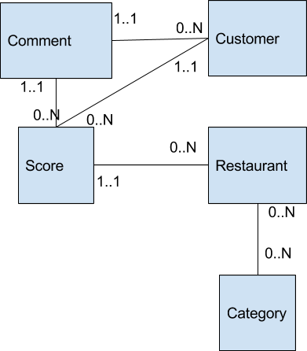

kata_doctrine (Rate-System)
=============

## Instructions

1) Clone project
2) Run ``docker-compose up -d``
3) Run ``composer install -n``
4) Add doctrine annotations on all **Entities**, according to the below schema



## Run

```bash
$ php bin/console doctrine:schema:create
$ php bin/console doctrine:fixtures:load -n
```

Try PHPMyAdmin => [http://127.0.0.1:8085](http://127.0.0.1:8085)


## Links

- https://symfony.com/doc/current/doctrine.html#add-mapping-information
- https://symfony.com/doc/current/doctrine/associations.html
- http://docs.doctrine-project.org/projects/doctrine-orm/en/latest/reference/working-with-associations.html#transitive-persistence-cascade-operations
- http://docs.doctrine-project.org/projects/doctrine-orm/en/latest/reference/association-mapping.html
